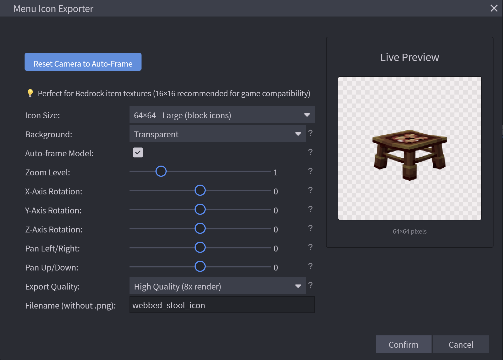

# Menu Icon Exporter for Blockbench

Export Blockbench models as clean menu or item icons with stable camera framing, live preview, and flexible save options.

Version: 1.0.0

## Current Features

- Auto-frame model with stable reset behavior
- Manual camera controls: zoom, rotate X/Y/Z, pan X/Y
- Isolated preview workflow for export camera updates
- Size presets: 16, 32, 48, 64, 128, plus custom size (8-512)
- Background options: transparent, white, black, gray, custom color
- Quality options: Standard (4x), High (8x), Ultra (16x)
- Save modes:
  - Ask every export
  - Auto-save to folder (desktop app)
- Persistent export preferences for save mode and output folder
- Quick export actions for 16x16 and 64x64
- Keyboard shortcut: Ctrl+Shift+I

## Installation

### Plugin Browser (Recommended)

1. Open Blockbench.
2. Go to `File -> Plugins`.
3. Search for `Menu Icon Exporter`.
4. Click Install.

### Manual Installation

1. Download `menu_icon_exporter.js` and `menu-icon-exporter.svg`.
2. Keep both files in the same folder.
3. In Blockbench, go to `File -> Plugins -> Load Plugin from File`.
4. Select `menu_icon_exporter.js`.

## How To Use

1. Open `File -> Export -> Export Menu Icon`.
2. Adjust camera controls and export settings.
3. Choose save behavior:
   - `Ask every export` to open a save dialog each time
   - `Auto-save to folder` to save directly to a selected folder
4. Click Confirm.

## Camera Controls

- Auto-frame: toggles automatic framing baseline
- Zoom Level: 0.5 to 3.0
- X/Y/Z Rotation: -180 to 180 (step 5)
- Pan Left/Right: -50 to 50
- Pan Up/Down: -50 to 50
- Reset Camera to Auto-Frame: restores default framed camera values

## Export Options

- Icon size preset or custom numeric size
- Custom background color when background is set to custom
- Export quality multipliers:
  - Standard: 4x render
  - High: 8x render
  - Ultra: 16x render
- Sanitized filename output (`.png` auto-applied)

## Quick Export Actions

- `Quick Export 16x16 Icon`
- `Quick Export 64x64 Icon`

Quick export uses auto-frame with transparent high-quality defaults.

## Notes

- Menu Icon Exporter outputs PNG icons that are usable across Blockbench formats and platforms; platform-specific size, naming, and folder rules still apply.
- Works with all Blockbench model formats.
- Auto-save to folder requires the desktop app (filesystem access).
- If an error references a different plugin filename, disable that plugin and retest.

## Author

NET

## License

This project is licensed under the MIT License. See [LICENSE](LICENSE).
